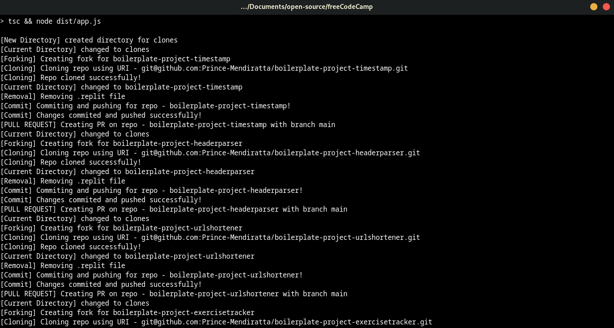
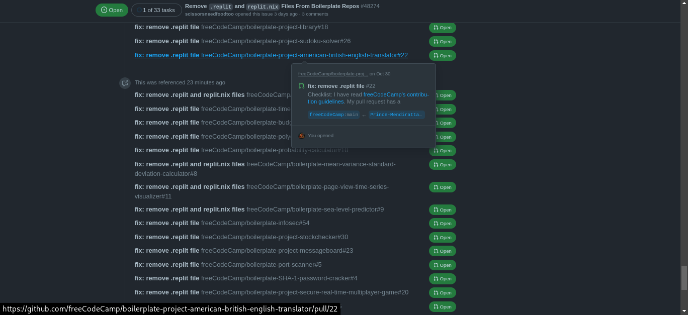

# mass-repo-editor
A program to make static changes to a large number of Github repos using Github API and some linux >:0

The main inspiration behind this project was to resolve [freeCodeCamp/freeCodeCamp#48274](https://github.com/freeCodeCamp/freeCodeCamp/issues/48274) in an effective manner.

Would I rather manually complete this task in a couple of hours or spend a few days automating it? Being a responsible developer, obviously I chose the latter to make this monotonous task a challenge, hence this script here.

## Installation
The only platform this has been tested on is Linux. btw I use arch.

```
git clone git@github.com:Prince-Mendiratta/mass-repo-editor.git
cd mass-repo-editor
yarn
npm start
```

## Screenshots
To demonstrate the final working of this project and how convenient it is, here's the output -


The final output showing the many PRs together -
